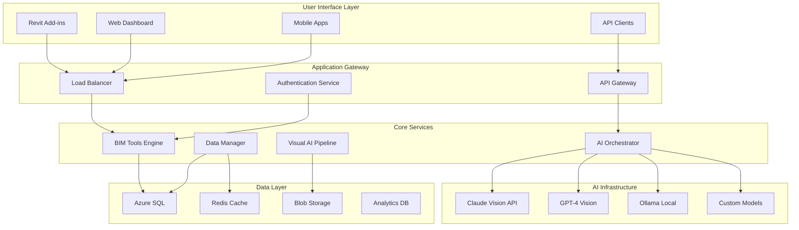
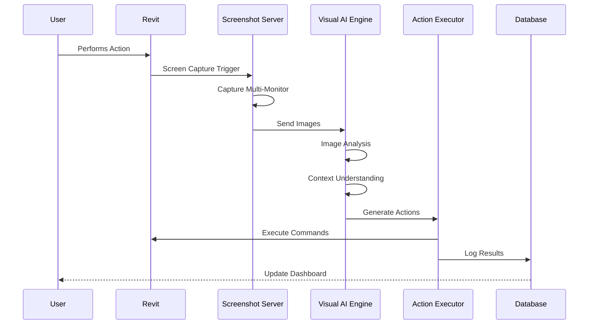
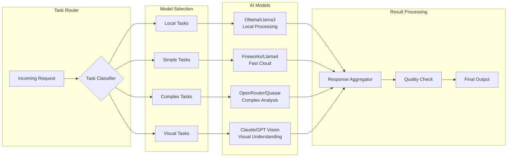
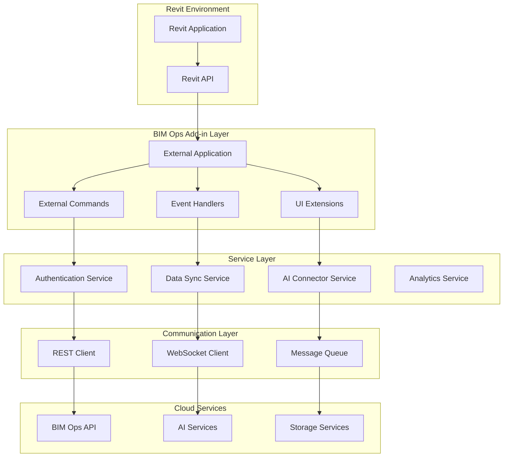
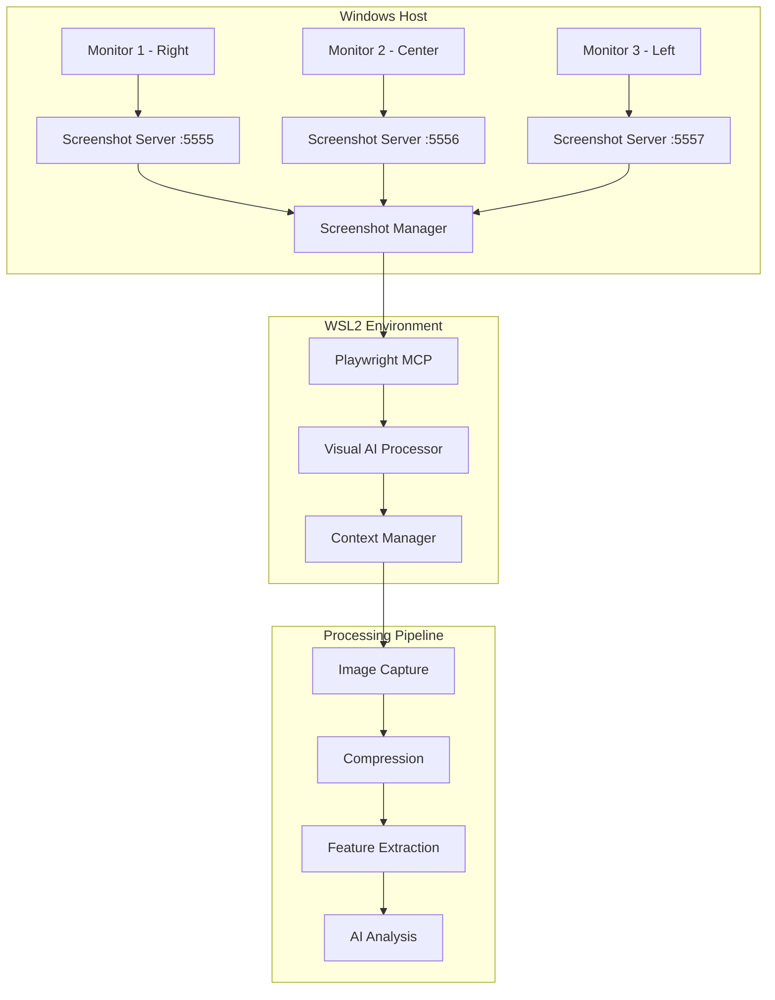
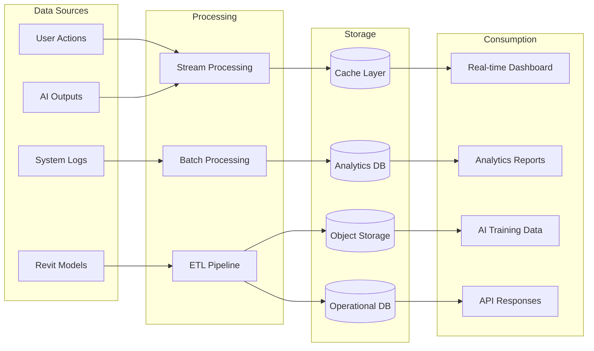
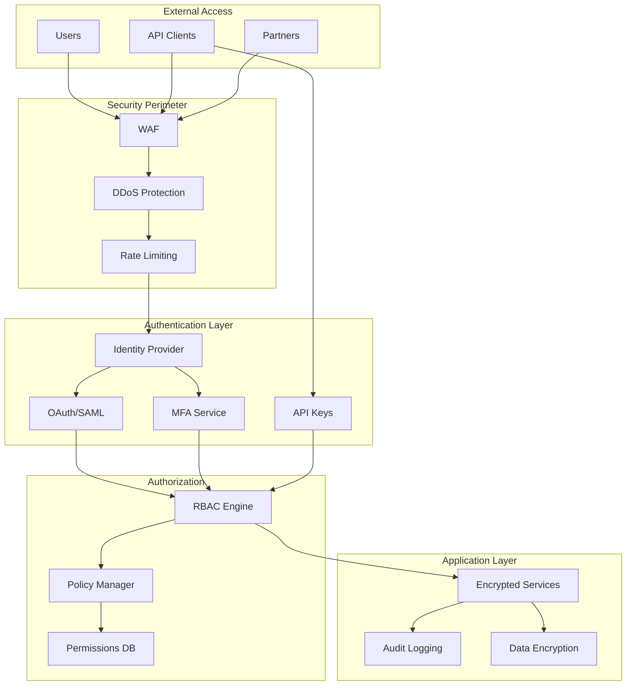
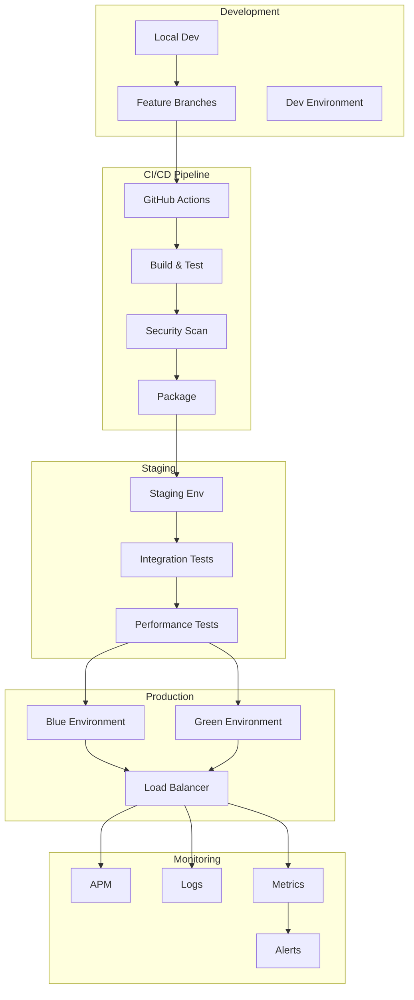
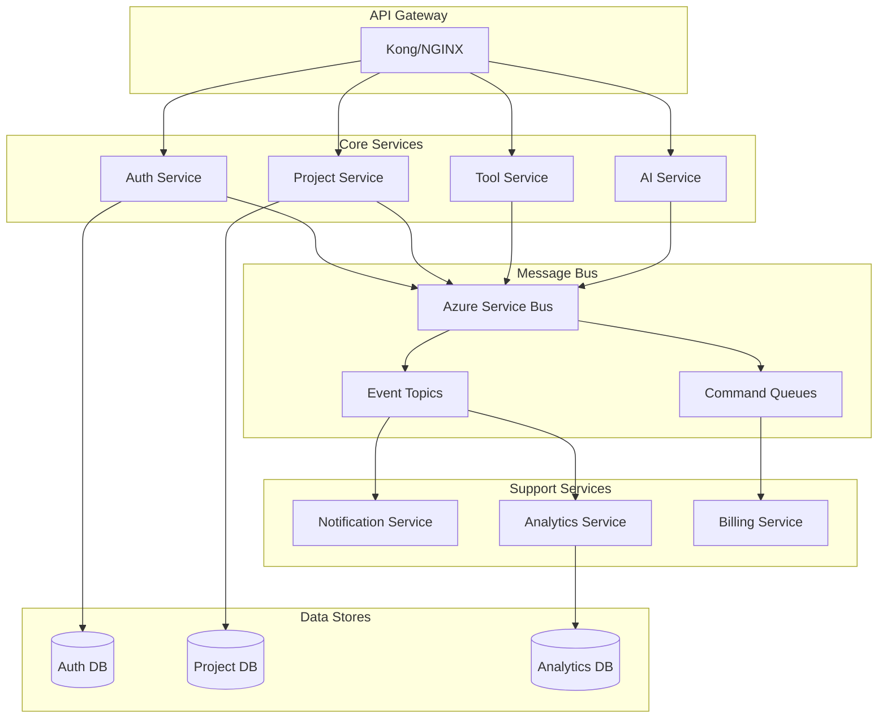
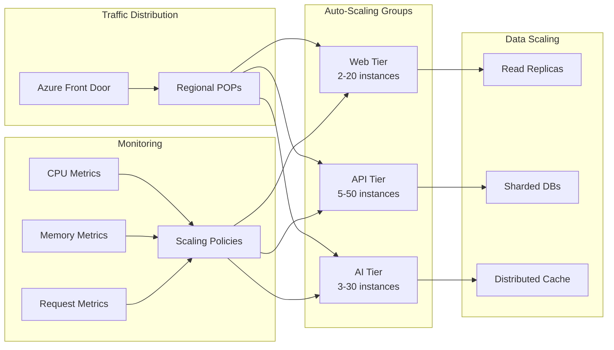

# SYSTEM ARCHITECTURE DIAGRAMS - BIM OPS STUDIO

## 1. HIGH-LEVEL SYSTEM OVERVIEW

## 2. VISUAL AI PROCESSING PIPELINE

## 3. MULTI-MODEL AI ORCHESTRATION

## 4. REVIT ADD-IN ARCHITECTURE

## 5. SCREENSHOT SERVER ARCHITECTURE

## 6. DATA FLOW ARCHITECTURE

## 7. SECURITY ARCHITECTURE

## 8. DEPLOYMENT ARCHITECTURE

## 9. MICROSERVICES COMMUNICATION

## 10. SCALABILITY ARCHITECTURE

## DIAGRAM USAGE NOTES

### For PowerPoint Presentations
1. Convert Mermaid diagrams to high-resolution images
2. Use consistent color scheme matching brand guidelines
3. Animate diagram elements for progressive disclosure
4. Include simplified versions for executive audiences

### Color Coding
- **Blue**: Core BIM Ops components
- **Green**: AI/ML services
- **Orange**: External integrations
- **Gray**: Infrastructure/Support
- **Red**: Security components

### Best Practices
1. Keep diagrams simple for slides
2. Use detailed versions for technical docs
3. Maintain consistent iconography
4. Include legends where necessary
5. Version control all diagram sources

### Tools for Diagram Creation
- **Mermaid**: For version-controlled diagrams
- **Draw.io**: For complex architectural diagrams
- **Lucidchart**: For collaborative editing
- **PowerPoint**: For presentation-ready versions

---

These diagrams provide a comprehensive visual representation of BIM Ops Studio's technical architecture, suitable for various audiences from technical teams to executives and investors.